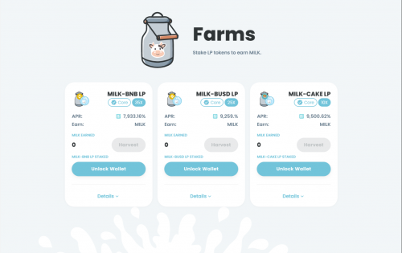
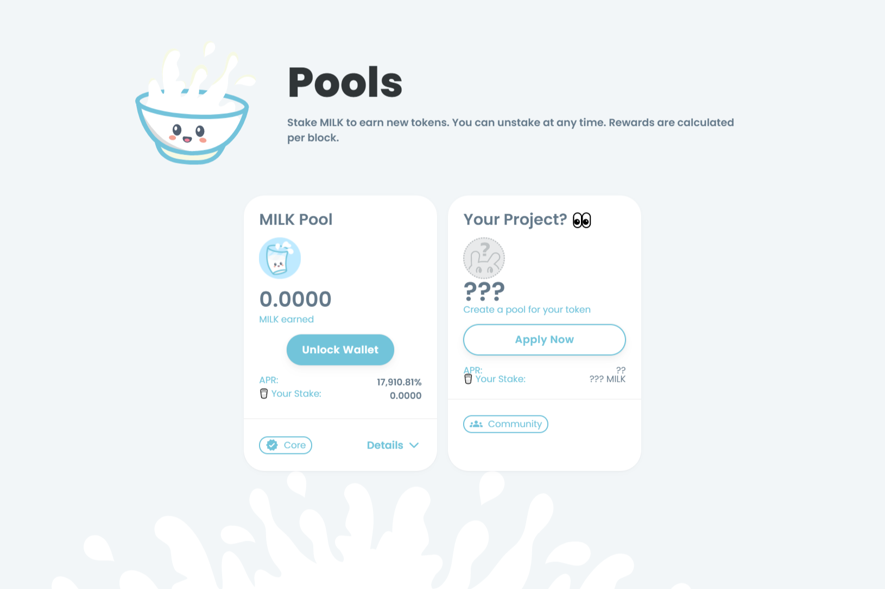

---
title: "MilkSwap"
description: "MilkSwap 是 BSC 链上的一个收益农业和 Staking 平台，他们选择 BSC 是因为即时确认、便宜的费用，还因为他们对币安有坚定的信念，他们认为它将成为加密领域的下一次发展。"
date: 2022-08-18T00:00:00+08:00
lastmod: 2022-08-18T00:00:00+08:00
draft: false
authors: ["seven"]
featuredImage: "milkswap.png"
tags: ["DeFi","MilkSwap"]
categories: ["nfts"]
nfts: ["DeFi"]
blockchain: "BSC"
website: "https://milkswap.netlify.app/"
twitter: "https://twitter.com/milkswap_bsc"
discord: ""
telegram: "https ://t.me/milkswap_bsc"
github: "https ://github.com/MilkSwap"
youtube: ""
twitch: ""
facebook: ""
instagram: ""
reddit: ""
medium: ""
steam: ""
gitbook: ""
googleplay: ""
appstore: ""
status: "Live"
weight: 
lightgallery: true
toc: true
pinned: false
recommend: false
recommend1: false
---

MilkSwap 是 BSC 链上的一个收益农业和 Staking 平台，他们选择 BSC 是因为即时确认、便宜的费用，还因为他们对币安有坚定的信念，他们认为它将成为加密领域的下一次发展。

由于在 BSC 上发生的事情，他们采取了以下步骤来确保每个人的安全。

部署 24 小时时间锁定合约。对智能合约所做的任何更改都将延迟 24 小时。我们将在引入所有矿池并确认奖励按预期工作后实施这一点。这比所有其他协议长 4 倍。
对合约的任何更改（例如添加新池）都将传达给社区。
他们已经Migrator从 Masterchef 合约中删除了该功能，现在您在耕种时不必担心您的资金问题。
移除 Migrator 功能并实施 24 小时时间锁定完全消除了地毯拉扯的风险，因为他们希望奶农能够毫无风险地进行养殖。

在代币发布之后，将铸造 MILK 以奖励流动性提供者，前 24 小时奖励4 MILK/块，接下来的 24 小时2 MILK/块，之后永远1 MILK/块。他们计划这次特殊的排放是为了为 MilkSwap 的早期用户争取更好的价值。

