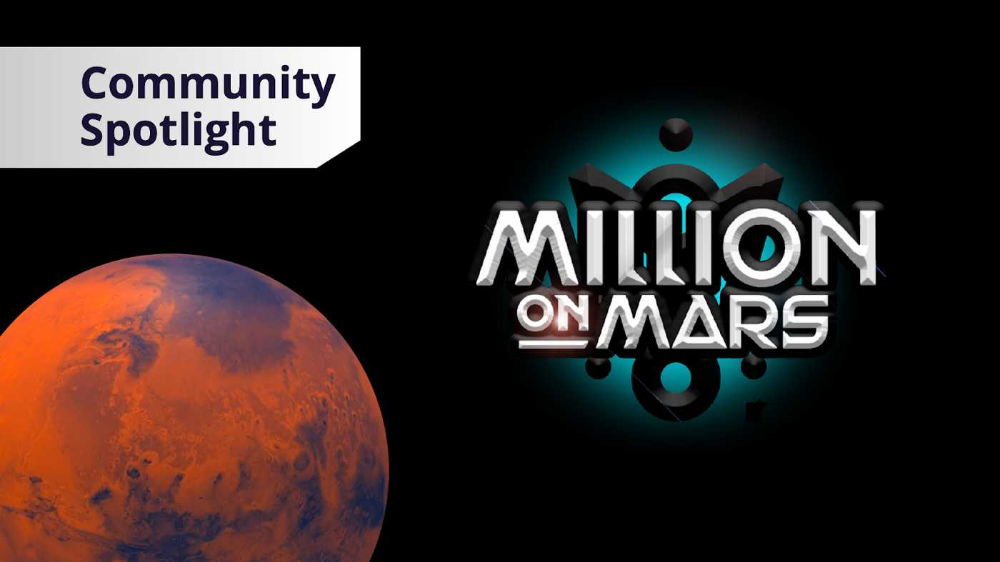

---
title: "Million on Mars"
description: "在这款基于网络的 Play & Own 游戏中，您刚刚登陆火星，生活看起来与地球上的生活截然不同。在真实的火星地形上搜寻资源，开发土地并在玩家拥有的经济中进行贸易。这是你的探索故事。工艺，制定战略，并在那里赢得自己的方式。"
date: 2022-08-18T00:00:00+08:00
lastmod: 2022-08-18T00:00:00+08:00
draft: false
authors: ["seven"]
featuredImage: "million-on-mars.png"
tags: ["NFT Games","Million on Mars"]
categories: ["nfts"]
nfts: ["NFT Games"]
blockchain: "WAX"
website: "https://milliononmars.io/?utm_source=DappRadar&utm_medium=deeplink&utm_campaign=visit-website"
twitter: "https://twitter.com/MilliononMars"
discord: "https://discord.com/invite/VvP82vCHYm"
telegram: ""
github: "https://github.com/MillionOnMars"
youtube: "https://www.youtube.com/channel/UCiVE9LC3FN3ohcWnratC5kQ"
twitch: ""
facebook: ""
instagram: ""
reddit: ""
medium: ""
steam: ""
gitbook: ""
googleplay: ""
appstore: ""
status: "Live"
weight: 
lightgallery: true
toc: true
pinned: false
recommend: false
recommend1: fals
---
在这款基于网络的 Play & Own 游戏中，您刚刚登陆火星，生活看起来与地球上的生活截然不同。在真实的火星地形上搜寻资源，开发土地并在玩家拥有的经济中进行贸易。这是你的探索故事。工艺，制定战略，并在那里赢得自己的方式。

在火星上寻找冒险，寻找可交易的资源并获得工作以赚取黄昏。

通过获取土地、存放建筑物和制作宝贵的资源，成为火星企业家。

制定您的土地使用策略，打造终极定居点，吸引冒险家并获得被动黄昏！

包和卡是 NFT，是您独有的不可替代的代币。让您在游戏内外拥有所有权。打开包装，揭示您定居红色星球所需的基本资源、建筑蓝图和土地契约！

10,000 个独一无二的 NFT 收藏，灵感来自火星元宇宙中的百万个角色，所有这些都具有真正的游戏实用程序。仅在索拉纳！

用特殊和稀有的游戏内特性改变游戏

跨13 个职业进行专业化和升级

自动化栖息地和定居点以增强游戏玩法

持续的游戏内奖励、代币、资源和未来的惊喜。

