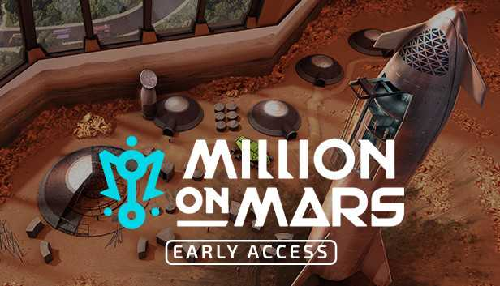

在这款基于网络的 Play & Own 游戏中，您刚刚登陆火星，生活看起来与地球上的生活截然不同。在真实的火星地形上搜寻资源，开发土地并在玩家拥有的经济中进行贸易。这是你的探索故事。工艺，制定战略，并在那里赢得自己的方式。

在火星上寻找冒险，寻找可交易的资源并获得工作以赚取黄昏。

通过获取土地、存放建筑物和制作宝贵的资源，成为火星企业家。

制定您的土地使用策略，打造终极定居点，吸引冒险家并获得被动黄昏！

包和卡是 NFT，是您独有的不可替代的代币。让您在游戏内外拥有所有权。打开包装，揭示您定居红色星球所需的基本资源、建筑蓝图和土地契约！

10,000 个独一无二的 NFT 收藏，灵感来自火星元宇宙中的百万个角色，所有这些都具有真正的游戏实用程序。仅在索拉纳！

用特殊和稀有的游戏内特性改变游戏

跨13 个职业进行专业化和升级

自动化栖息地和定居点以增强游戏玩法

持续的游戏内奖励、代币、资源和未来的惊喜。

