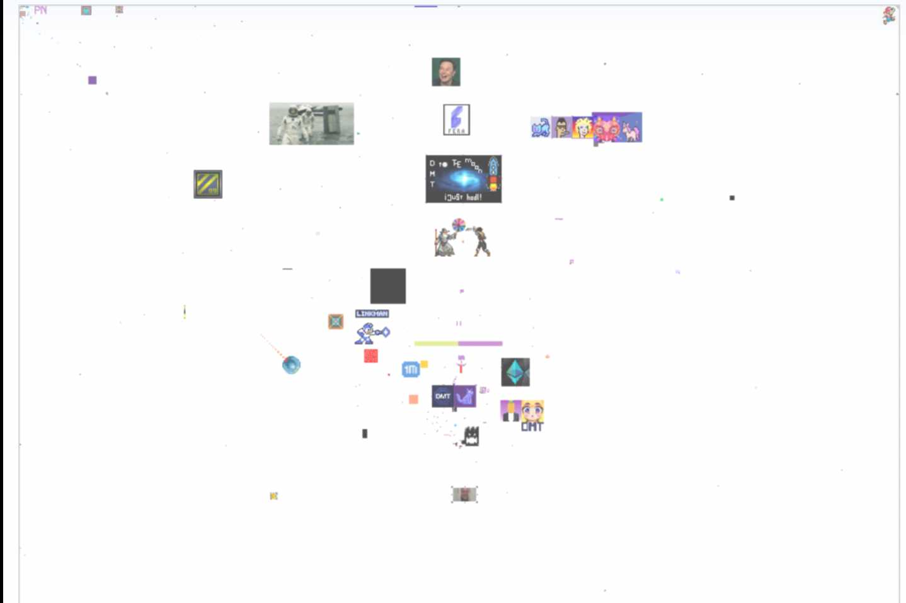
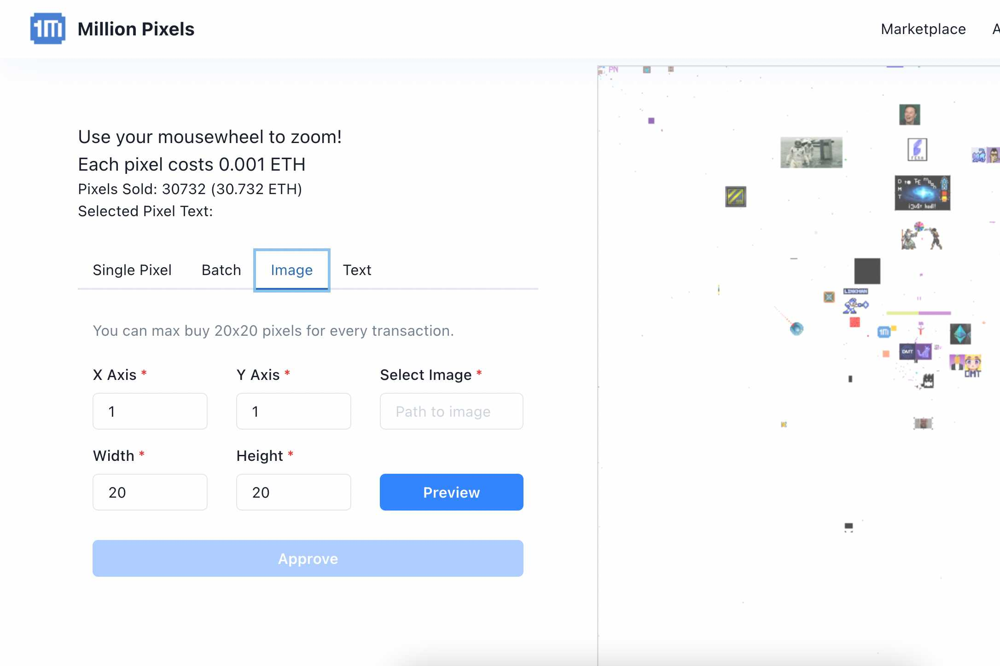
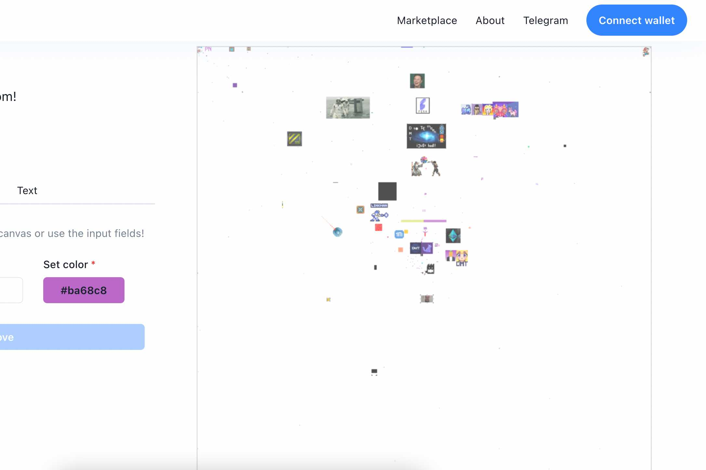

暗物质生态系统使人们能够创建相互关联的项目，同时让每个项目重新获得完全的自主权和独立性。暗物质网络上的独立项目不必相互依赖，但如果它们盈利，收入将分配给所有暗物质代币流动性提供者。这是一种激励创造力和探索区块链技术新可能性的简单方法。

在暗物质生态系统中创建的大量项目探索了不可替代代币的想法。NFT 是目前为数不多的将区块链技术与艺术创作自由成功结合的流行解决方案之一。

尽管 DMT 最初是一个基于以太坊的项目，但我们已经扩展到 Polygon（以前称为 Matic）网络，由于接近于零的费用，它为 NFT 创造者提供了更大的表达自由！虽然我们的项目仍然可以在基于 ETH 的 OpenSea.io NFT 市场上访问，但我们计划在不久的将来完全迁移到 Polygon/Matic 生态系统。

DMT 百万像素项目沿着记忆之路走一趟，重振雄心勃勃的 MillionDollarHomepage 努力的精神。这一次，画布将不仅仅是一个广告牌；这将是一幅艺术拼贴画，每个 Pixel 都将是自己的 NFT！

Million Pixels 是一个完全去中心化、社区驱动、基于区块链的像素艺术画廊，我们对此感到非常兴奋！旧的想法和新技术完美地融合在一起，迎来了数字表达的美丽执行。

该网站将允许世界上任何地方的任何人购买 Pixel 空间并随心所欲地使用它。您可以购买单个像素，也可以购买一组像素以创建更大的图像。您可以使用它们来宣传您自己的项目或创作小型（或大型）艺术杰作。

想想购买 Pixel 就像从 Decentraland 或 Sandbox 购买数字土地。您的 Pixel 空间是您自己的（保存在您的钱包中），您可以随意管理它。当百万像素的价值随着时间的推移而增长时，您可以转售您的像素空间并赚取利润。

