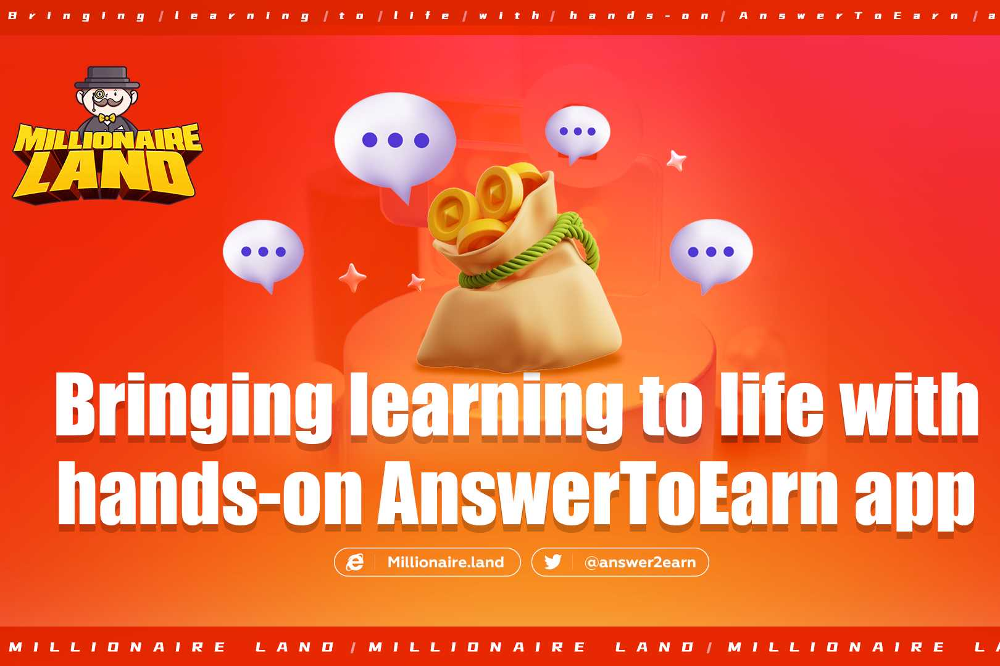
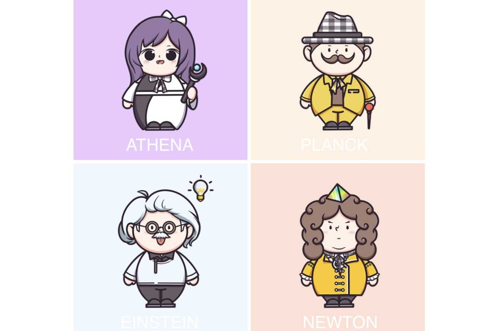
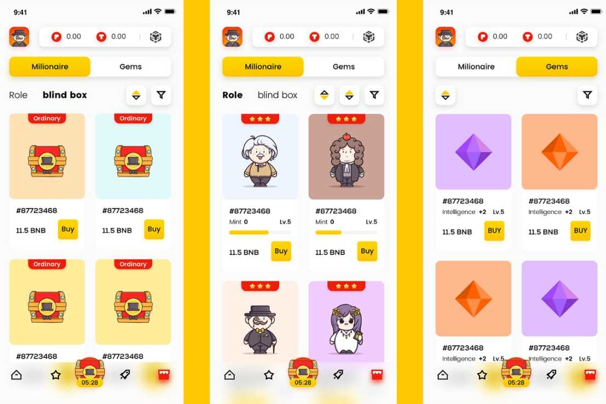

Millionaire Land 旨在构建一个具有 ANSWER TO EARN 模型的新型 web3 应用程序。用户将能够通过使用 NFT 角色在问答比赛中回答问题来获得奖励。玩家可以通过创新的玩法增长智慧，同时获得收益。这就是新 web3 空间的现实。

Millionaire Land是一种双通证模型，一种是TOK(test of knowledge)，是代表Millionaire Land中知识奖励的游戏Token，主要通过AnswerToEarn获得。代币没有供应限制，作为答案奖励分发给玩家。TOK正在支付APP的各种功能，包括对铸币、角色NFT健康修复、角色NFT升级、宝石升级、解锁槽位、重置角色属性等。以上应用场景中用于支付的所有TOK都会被销毁。

还有一个是POK（Power of Knowledge），它是平台的治理代币，也是某些高级功能的支付代币。总供应量为 30 亿个代币。POK主要通过AnswerToEarn发放，$POK奖励每三年减半一次。其他是公募、投资锁定、生态发展、团队控股等。

