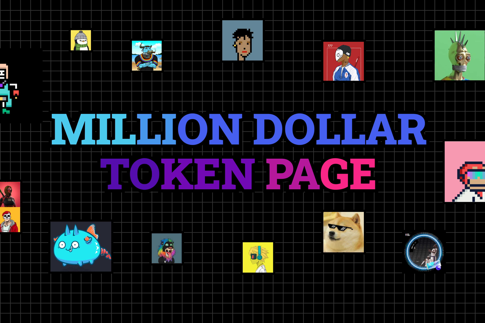
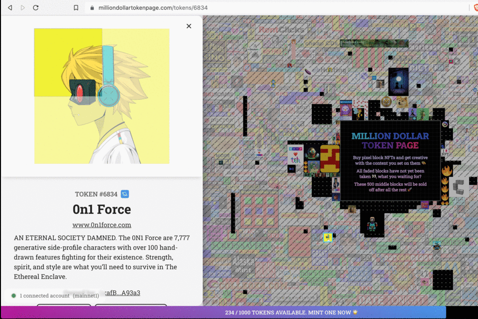
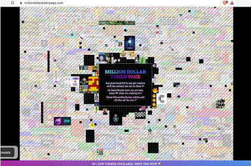

---
title: "Milliondollartokenpage"
description: "MDTP 是加密 Ξra 中的百万美元主页。炫耀和分享 NFT，并拥有一段加密历史！"
date: 2022-08-18T00:00:00+08:00
lastmod: 2022-08-18T00:00:00+08:00
draft: false
authors: ["seven"]
featuredImage: "milliondollartokenpage.png"
tags: ["Collectibles","Milliondollartokenpage"]
categories: ["nfts"]
nfts: ["Collectibles"]
blockchain: "ETH"
website: "https://milliondollartokenpage.com/about"
twitter: "https://twitter.com/tokenpagexyz"
discord: "https://discord.com/invite/bUeQjW4KSN"
telegram: ""
github: ""
youtube: ""
twitch: ""
facebook: ""
instagram: ""
reddit: ""
medium: ""
steam: ""
gitbook: ""
googleplay: ""
appstore: ""
status: "Live"
weight: 
lightgallery: true
toc: true
pinned: false
recommend: false
recommend1: false
---
MDTP 是加密 Ξra 中的百万美元主页。炫耀和分享 NFT，并拥有一段加密历史！

在2005年创建时，milliondollarhomepage充当了互联网上的广告板，以每个1美元的价格在网络上销售100万像素。那时的网络仍然非常静态，没有数字原生形式的交易价值，所以当像素被购买和设置时，它们不能再被重新出售或更新

现在，互联网更加变得有趣，比特币和以太坊等加密货币迎来了全新的时代，即web3，在这个时代，以代币和NFT为代表的数字原生货币和资产可以公开进行点对点交易互联网。MDTP将这些现代创新融入到最初的想法中，以构建一个更有趣更实用的虚拟空间来分享您喜欢的任何内容

