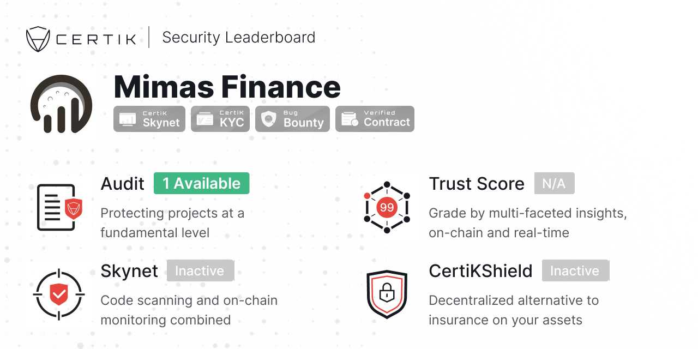
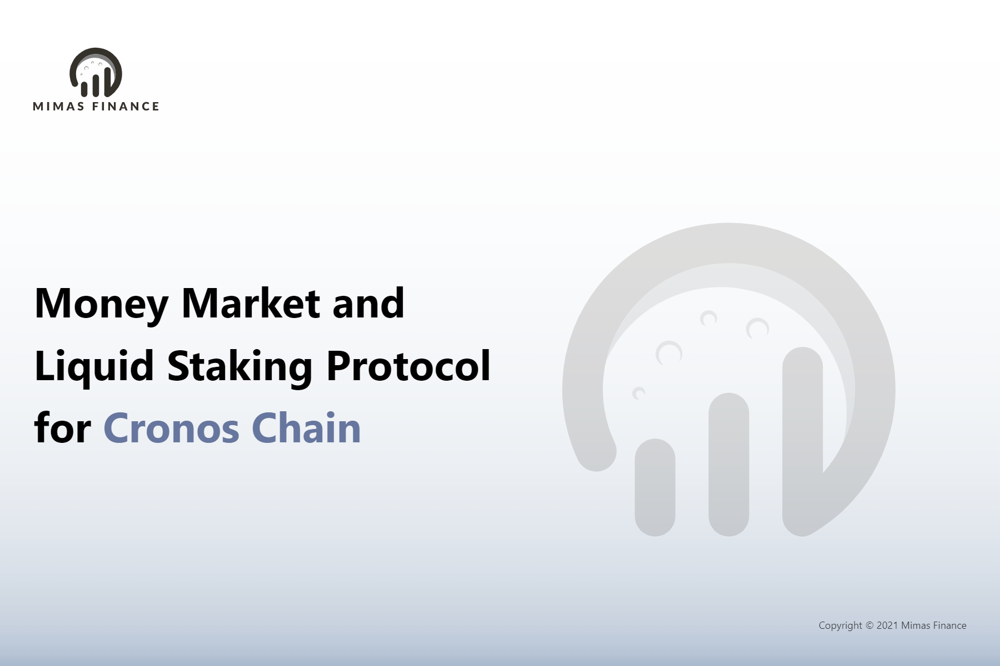

Mimas Finance是 Cronos 区块链上的算法货币市场和流动性质押协议。它由在 Harmony 区块链上由Tranquil背后的同一团队构建，它允许用户提供和借入资产，同时以完全无需许可和去中心化的方式接收或支付利息。借贷利息根据市场需求设定，贷款超额抵押以保证偿付能力。

Mimas Finance 是 Tranquil Finance（从 Compound 分叉）的一个分支，它已经过CertiK 的审计，并已在波动的市场条件下成功运行了数月，拥有数千万的 TVL。我们基于 DEX 的 TWAP*完全去中心化的*价格预言堆栈，无需 Chainlink 即可工作，已在现场得到证明和验证。

Mimas Finance 也已通过CertiK的审计。

Mimas 协议智能合约是从 Compound 协议中分叉出来的，Compound 协议是一个经过深度实战考验的协议，变化很小。我们使用的协议与已通过 CertiK 成功审计的Tranquil Finance相同。我们还计划与 CertiK 一起进行 Mimas 特定审核。

