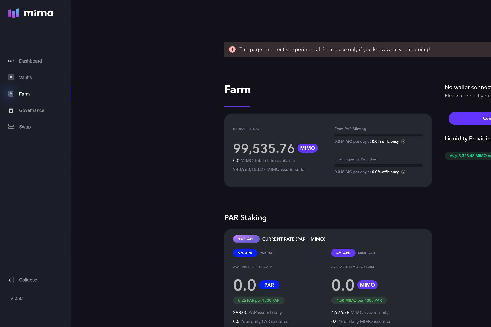
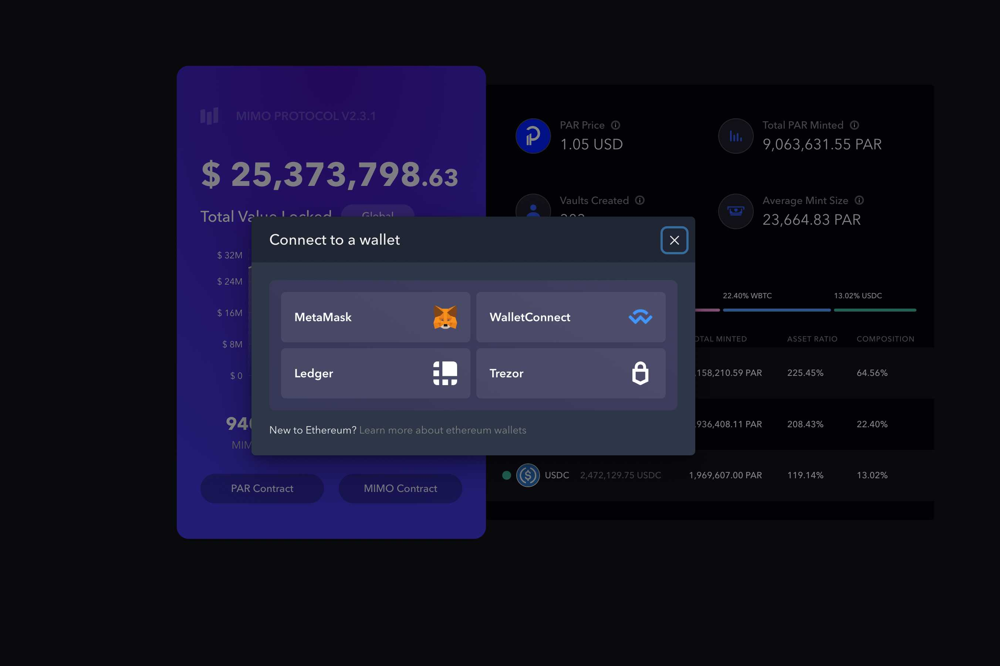
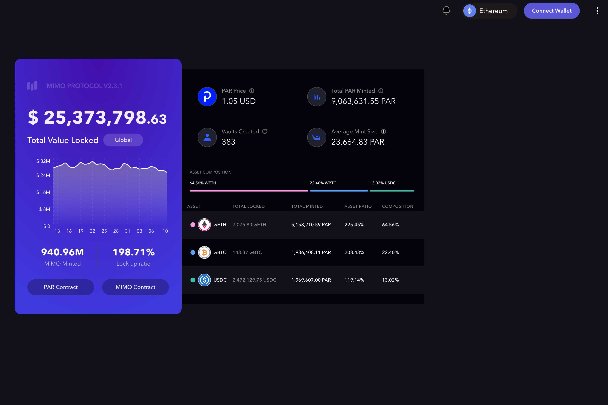

---
title: "Mimo DeFi"
description: "Mimo 提供了一套应用程序，旨在允许用户使用他们的数字资产（例如 ETH 或 BTC）来铸造 PAR 代币，弥合 DeFi 世界与受监管金融机构世界之间的现有鸿沟。"
date: 2022-08-18T00:00:00+08:00
lastmod: 2022-08-18T00:00:00+08:00
draft: false
authors: ["seven"]
featuredImage: "mimo-defi.png"
tags: ["DeFi","Mimo DeFi"]
categories: ["nfts"]
nfts: ["DeFi"]
blockchain: "ETH"
website: "https://app.mimo.capital/?utm_source=DappRadar&utm_medium=deeplink&utm_campaign=visit-website"
twitter: "https://twitter.com/mimodefi"
discord: ""
telegram: "https://t.me/mimodefi"
github: ""
youtube: "https://www.youtube.com/channel/UCTItyzBBVqUVfOeek2iVX_Q"
twitch: ""
facebook: ""
instagram: ""
reddit: ""
medium: ""
steam: ""
gitbook: ""
googleplay: ""
appstore: ""
status: "Live"
weight: 
lightgallery: true
toc: true
pinned: false
recommend: false
recommend1: false
---
反对抵押品面值的薄荷稳定币：过度抵押的欧元

我们相信金钱的未来是自我保管。Mimo 提供了一套应用程序，旨在允许用户使用他们的数字资产（例如 ETH 或 BTC）来铸造 PAR 代币，弥合 DeFi 世界与受监管金融机构世界之间的现有鸿沟。

PAR 代币是一种与欧元挂钩的价格稳定代币。易于生成、访问和使用。用户通过将抵押资产存入 MIMO 协议中的 MIMO 保险库来生成 PAR。

全面审核

Mimo 和 PAR 以安全和安全为核心，经过 Quantstamp 的全面审核。在这里找到我们的完整审计报告

多链

真正去中心化也意味着广泛可用。Mimo 和 PAR 可在 Ethereum、Polygon、Fantom 等平台上使用。

稳定的 PEG

流通中的每一个 PAR 都直接由超额抵押品支持，这意味着抵押品的价值高于铸造的 PAR 的价值，并且所有 PAR 交易在链上都是公开可见的。

DEX & CEX

PAR 是第一个在 Fantom、Polygon 和 Ethereum 上具有 CEX 原生支持的欧元稳定代币。可用于 Curve、Spookyswap 和 Balancer

Mimo 使用保险库来存放您的资产。您的保险库是安全的、独一无二的，而且您的资产永远不会被借出。随心所欲地存款和取款，协议中的所有保险库都包含在安全储备中。

