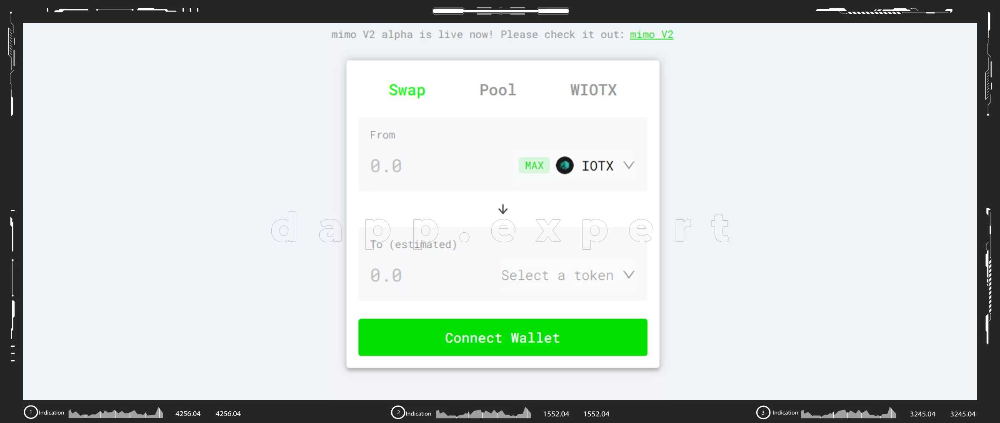
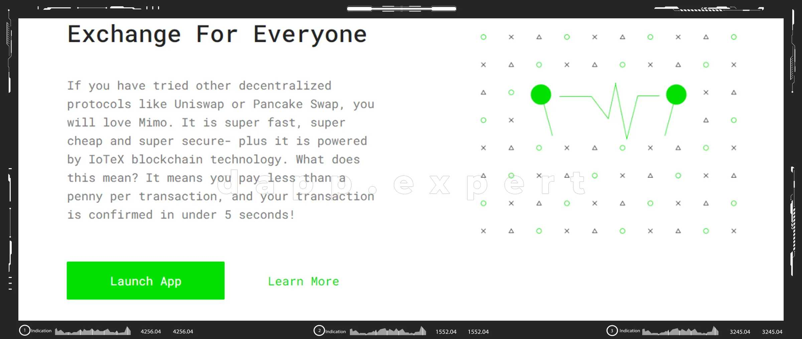

---
title: "Mimoswap v1"
description: "Mimo，一种全新的协议，将推动 IoTeX 上的下一波去中心化金融 (DeFi)。mimo 的愿景是赋能下一代 DeFi 产品，这些产品利用我们最先进的自动化流动性协议和 IoTeX 平台的闪电般的速度、低 gas 费用和跨链。"
date: 2022-08-18T00:00:00+08:00
lastmod: 2022-08-18T00:00:00+08:00
draft: false
authors: ["seven"]
featuredImage: "mimoswap-v1.png"
tags: ["Exchanges","Mimoswap v1"]
categories: ["nfts"]
nfts: ["Exchanges"]
blockchain: "IoTeX"
website: "https://v1.mimo.exchange/swap"
twitter: "https://twitter.com/mimoprotocol"
discord: ""
telegram: "https://t.me/mimoprotocol"
github: "https://github.com/mimoprotocol"
youtube: ""
twitch: ""
facebook: ""
instagram: ""
reddit: ""
medium: ""
steam: ""
gitbook: ""
googleplay: ""
appstore: ""
status: "Live"
weight: 
lightgallery: true
toc: true
pinned: false
recommend: false
recommend1: false
---
Mimo，一种全新的协议，将推动 IoTeX 上的下一波去中心化金融 (DeFi)。mimo 的愿景是赋能下一代 DeFi 产品，这些产品利用我们最先进的自动化流动性协议和 IoTeX 平台的闪电般的速度、低 gas 费用和跨链。

如果您尝试过其他去中心化协议，例如 Uniswap 或 Pancake Swap，您会喜欢 Mimo。它超级快速、超级便宜和超级安全——而且它由 IoTeX 区块链技术提供支持。这是什么意思？这意味着您每笔交易支付不到一分钱，并且您的交易在 5 秒内得到确认！

mimo 与ioTube 一起工作，ioTube是一个让其他区块链用户受益于 IoTeX 的速度和低成本的桥梁 。但跨链互操作性只是 mimo 让每个人都能更好地进行交易的方式之一。

