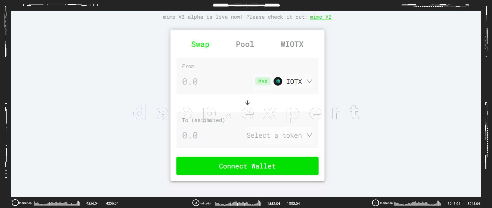

---
title: "Mimoswap v2"
description: "mimo v2 为流动性提供者提供了灵活性，他们现在可以创建任意数量的自定义 XRC20-XRC20 头寸，并为交易者带来强大的好处，例如通过优化路由降低滑点和更好的定价。此外，mimo v2 与Web3 兼容且对开发人员友好——新用户可以通过 MetaMask 访问 mimo 以实现无缝入门，开发人员可以轻松地在 mimo v2 之上构建新的 DeFi 工具/服务。"
date: 2022-07-31T00:00:00+08:00
lastmod: 2022-07-31T00:00:00+08:00
draft: false
authors: ["seven"]
featuredImage: "mimoswap-v2.png"
tags: ["Exchanges","Mimoswap v2"]
categories: ["nfts"]
nfts: ["Exchanges"]
blockchain: "IoTeX"
website: "https://mimo.exchange/?utm_source=DappRadar&utm_medium=deeplink&utm_campaign=visit-website#/swap"
twitter: "https://twitter.com/mimoprotocol"
discord: ""
telegram: "https://t.me/mimoprotocol"
github: "https://github.com/mimoprotocol"
youtube: ""
twitch: ""
facebook: ""
instagram: ""
reddit: ""
medium: ""
steam: ""
gitbook: ""
googleplay: ""
appstore: ""
status: "Live"
weight: 
lightgallery: true
toc: true
pinned: false
recommend: false
recommend1: false
---
mimo v2 为流动性提供者提供了灵活性，他们现在可以创建任意数量的自定义 XRC20-XRC20 头寸，并为交易者带来强大的好处，例如通过优化路由降低滑点和更好的定价。此外，mimo v2 与Web3 兼容且对开发人员友好——新用户可以通过 MetaMask 访问 mimo 以实现无缝入门，开发人员可以轻松地在 mimo v2 之上构建新的 DeFi 工具/服务。

如果您尝试过其他去中心化协议，例如 Uniswap 或 Pancake Swap，您会喜欢 Mimo。它超级快速、超级便宜和超级安全——而且它由 IoTeX 区块链技术提供支持。这是什么意思？这意味着您每笔交易支付不到一分钱，并且您的交易在 5 秒内得到确认！

要访问 mimo，您必须首先拥有 IoTeX 地址。您可以通过ioPay创建桌面版和移动版的官方 IoTeX 钱包。打开你的ioPay，打开mimo App（来）并连接你的钱包。在交易之前，您需要一些 IOTX 来支付 gas 费用——幸运的是，mimo 的费用非常低，几乎为零！在“掉期”选项卡下，您现在可以浏览各种交易对的掉期率并通过使用您的ioPay钱包进行交易。

