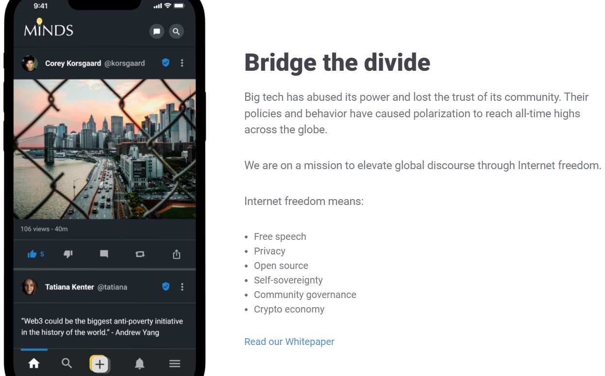
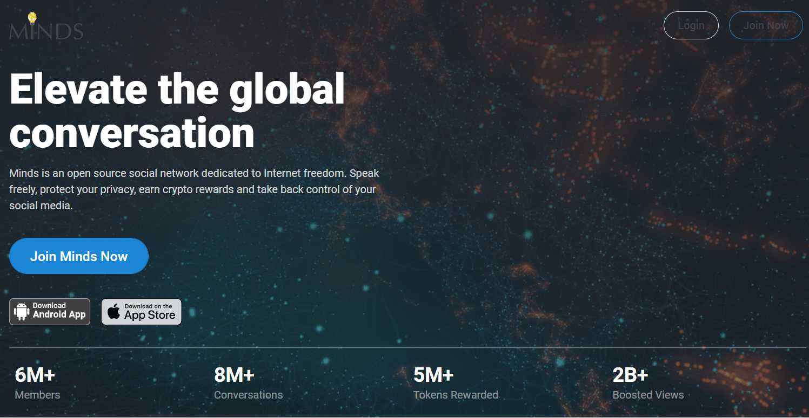

Minds 是一个建立在隐私、透明和用户控制基础上的开源社交网络。用户通过对网络的贡献获得代币，并可以将其用于广告或同行的优质内容订阅。

他们坚持某些原则，以确保您可以不受限制地实时访问网络上共享的所有信息。

他们的代码和算法是免费和开源的，以实现最大的透明度和问责制。他们的内容政策基于第一修正案并由社区陪审团管理，以尽量减少偏见和审查。

他相信，只有为用户提供一个表达想法的平台，您才能改变他们的想法。

社交网络的价值在于其社区。您应该为网络的成功和发展做出的贡献而获得奖励。

Minds 每天都会用 MINDS 代币 (ERC-20) 奖励您创建流行内容、推荐朋友或提供流动性。然后，这些代币可用于宣传您的内容（1 个代币 = 1,000 次展示）或向内容创建者发送提示以表示您的支持并解锁特殊福利。

升级到 Minds+ 以访问优质内容并提交您自己的内容以分享我们的收入。

