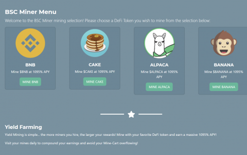
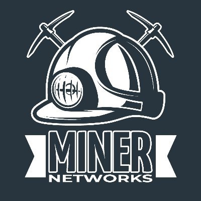

Yield Mining 应用程序网络，适用于 Ethereum、Polygon Matic、Binance Smart Chain 和 Tron Network

Yield Mining 与 Yield Farming 不同，Yield Mining 的矿工是被雇佣的，不能被出售。您聘请的矿工不断工作，每天为您提供 3% 的回报！

使用来自每个网络的您最喜欢的 DeFi 代币，雇佣 Mining Power 每天赚取 3% 的收益，相当于1095% 的 APY！

一旦你开始赚钱，你就可以通过雇佣更多的矿工来增加你的收入！

收益挖矿很简单……您雇用的矿工越多，您的奖励就越大！用你最喜欢的 DeFi 代币挖矿，赚取 1095% 的巨额 APY！

