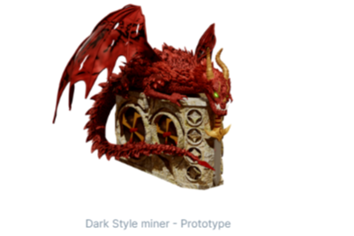
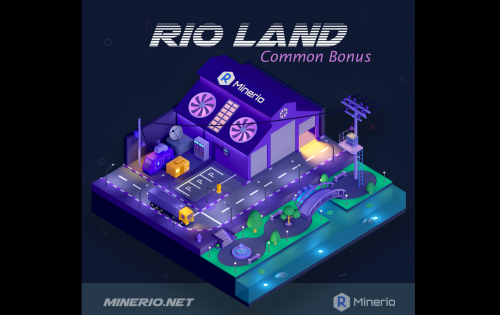
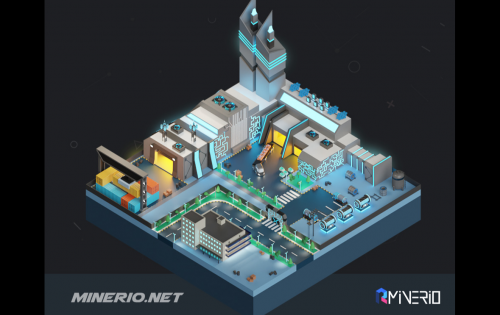

Minerio 是一款使用 RIO 代币赚取加密货币挖矿模拟器游戏的闲置策略游戏。要获得 RIO 代币，您应该购买 Miner NFT、租用仓库、支付电源、网络和其他公用事业费用，并尽可能产生最高的哈希率。

游戏是空闲的 - 策略，很容易学习和玩。然而，对于想要更多收入的职业玩家来说，Minerio 游戏有一个深度学习曲线。例如，网络工程师可以配置您的仓库互联网连接并减少瓶颈，或者让您的矿工集群以从中获得更多的哈希率。

游戏背后的网络被称为“绿洲”，所有矿工 NFT 都连接到这个网络。您将根据您的总算力获得 Oasis RIO 奖励池的份额。

矿工是可以挖掘 RIO 代币的 NFT。当你玩 Minerio 游戏时，这些矿工可以通过工作来赚钱，就像在现实世界中一样。要挖掘 RIO 代币，您应该至少购买一个矿工 NFT，将其连接到游戏网络，并使用我们的工具开发哈希率。

Minerio 元宇宙中有大量的矿工。您可以根据技术、风格、品牌、特权或大小来选择您的矿机。

RIO 代币。租用仓库、供电、网络访问、安全、管理等是一些服务示例。在 Minerio 虚拟世界中，您可以购买您的矿工并在工业站点上创建一个挖矿站点。每个站点都提供您需要的服务并向您收取 Rio 代币的费用。每个站点都分为几个称为“土地”的子区域。购买土地后，您可以开始质押您的土地 NFT 并生成 RIO 代币作为土地租金。

