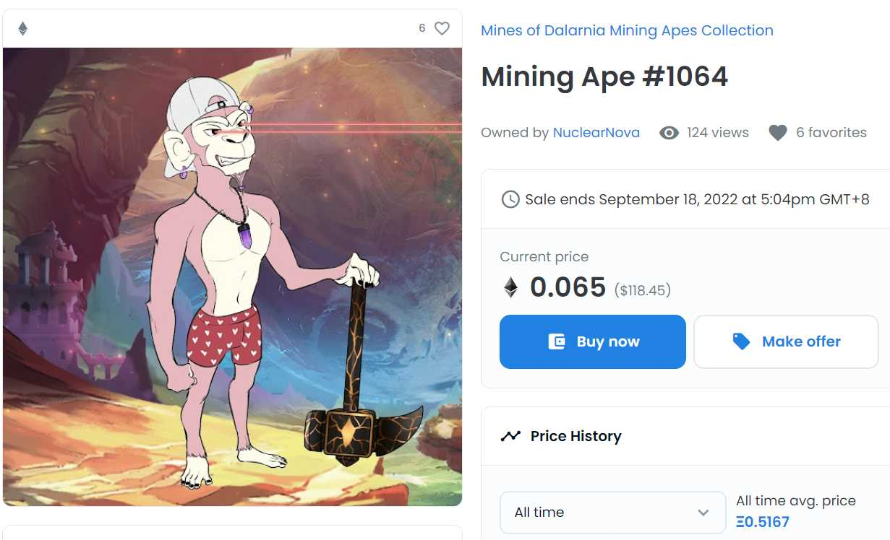
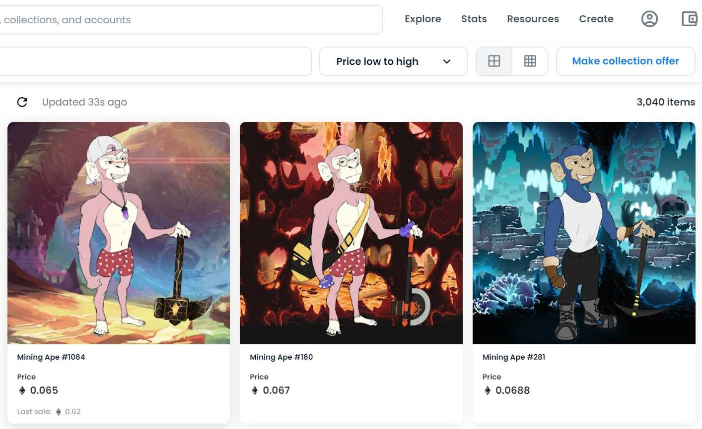

Mining Apes Collection 由 Mines of Dalarnia 为达拉尼亚星球上的早期探险者发行。Mining Apes 是以太坊区块链上的 10,000 个 NFT。它们是使用算法生成的，每个 Mining Ape 都是独一无二的。Mining Ape NFT 是一种身份象征，当您为 Dalarnia 社区做出贡献时，它会为您提供长期利益。欲了解更多详情，请访问 minesofdalarnia.com，或加入我们的电报

