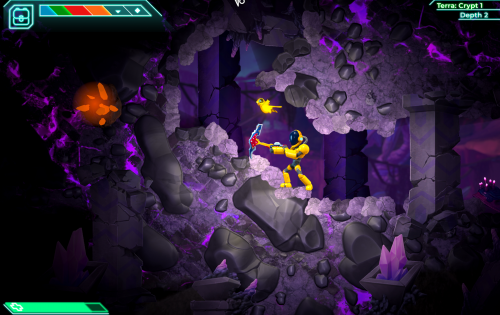
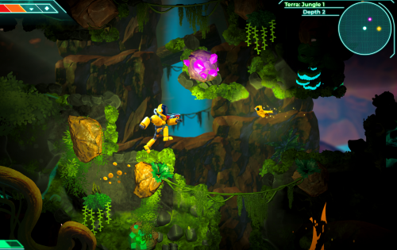
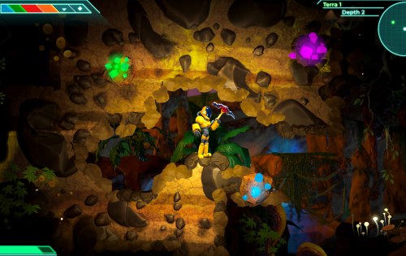

这是 11,752 年。超星系团统治着大多数已知的系统。一个仁慈但难以理解的人工智能被称为 Onemind 引导集体，确保和平与繁荣。Onemind 揭示了一项革命性的新技术：地球化胶囊。这些胶囊使行星在几秒钟内自发地经历数百万年的进化。一个名为达拉尼亚的区域中的三颗行星已被选中进行第一波地球化实验。来自银河系各地的人们涌向新改造的行星，在太空淘金热中寻找自己的财富。作为这些充满希望的矿工之一，您已经花费毕生积蓄前往系统外围的月球。你准备好在达拉尼亚矿区发财了吗？

深入未知的黑暗矿井。收集资源以提高您的设备和属性，以便您可以面对深度的危险。

混合战斗和地牢爬行，达拉尼亚的矿山利用区块链技术的力量为该类型提供了一个全新的入口。

达拉尼亚拥有丰富的资源供探险家和投资者发现、收集和交易。

所有的项目和动作都注册在区块链上，具有去中心化的治理。

收集稀有资源，升级您现有的工艺新设备，竞争并赢得奖励。

开放市场以交易和交换 NFT，并为土地所有者提供丰厚的回报。

