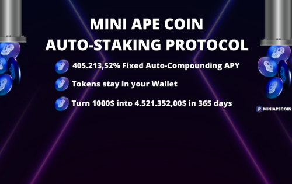
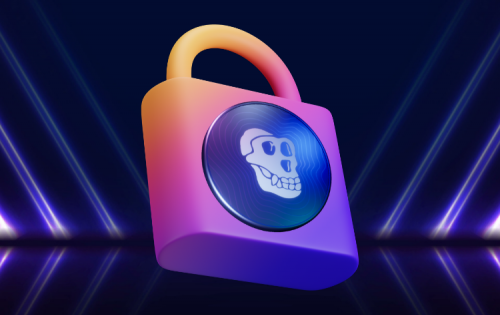
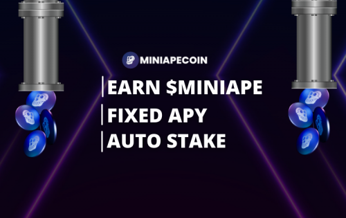

Mini Ape Coin 是一种自动质押协议，每 15 分钟自动复合并质押您投资的 0.02%！将 405,213.52% 的最高可持续固定 APY 与透明的工作和经验丰富的营销机构相结合。只需在钱包中持有 $MINIAPE，即可赚取高达 405 倍的初始投资 - 享受 DeFi 3.0 的力量

MINIAPE 是报酬最高的去中心化金融资产，它通过使用其独特的 FAP 协议以固定的 APY 复利模型奖励用户。

MINIAPE 提供业界最高的固定 APY，每 15 分钟支付一次，以及一个简单的买入持有收益系统，可以增加您的 $MINIAPE投资组合。

MINIAPE 是支付利息变基奖励的原生代币。每个代币持有者每 15 分钟自动获得 0.02371% 的利息，仅用于持有 MINIAPE 代币——直接支付到您的钱包中。保险基金有助于维持 MINIAPE 协议并支持支付给所有 MINIAPE 代币持有者的一致的 0.02371% 正基准利率。通过他们的 Auto-Burn 程序，所有 MINIAPE 交易中有 2% 被销毁。交易的越多，你的代币就越值钱。代币进入火炉以减少循环供应并保持 MINIAPE 协议稳定。MINIAPE 财政部在 MINIAPE 代币价格大幅下跌的情况下为 MINIAPE 保险基金提供支持；它得到大量回购。MINIAPE Treasury 还用于大规模营销活动、新的 MINIAPE 开发和投资。Crypto 最高的自动抵押和自动复合协议，世界上最大的固定 APY 为 405,213.52%。每个持有 MINIAPE 代币的钱包的利息奖励每 15 分钟计算一次。它得到了财政部的支持。

