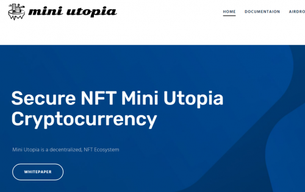
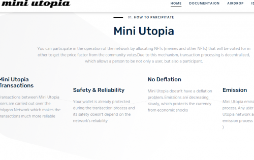
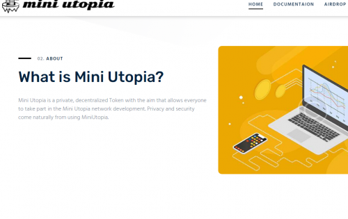

---
title: "Mini Utopia"
description: "Miniutopia 是一个面向 Polygon、BSC、ETH、SOL、Cardano 等用户的 NFT 生态系统。"
date: 2022-08-18T00:00:00+08:00
lastmod: 2022-08-18T00:00:00+08:00
draft: false
authors: ["seven"]
featuredImage: "mini-utopia.png"
tags: ["High risk","Mini Utopia"]
categories: ["nfts"]
nfts: ["High risk"]
blockchain: "Polygon"
website: "https://miniutopia.co/"
twitter: "https://twitter.com/miniutopiatoken"
discord: ""
telegram: "https://t.me/miniutopiatoken"
github: ""
youtube: ""
twitch: ""
facebook: ""
instagram: ""
reddit: ""
medium: ""
steam: ""
gitbook: ""
googleplay: ""
appstore: ""
status: "Live"
weight: 
lightgallery: true
toc: true
pinned: false
recommend: false
recommend1: false
---
Miniutopia 是一个面向 Polygon、BSC、ETH、SOL、Cardano 等用户的 NFT 生态系统。它是第一个也是唯一一个旨在使用投票系统来确定 NFT 价格的平台，而不是由创造者决定价格。这实际上消除了 NFT 购买者遭受无常损失的风险。对于选民来说，Mini Utopia 是唯一可以让选民通过参与生态系统获得奖励的 DeFi 协议，从而降低清算风险。

