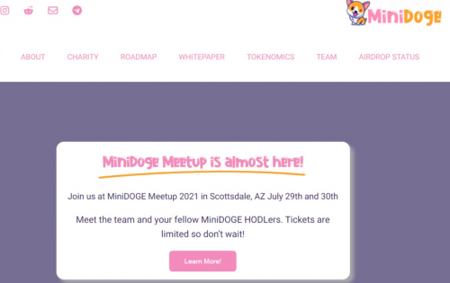
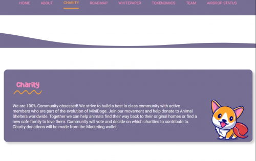
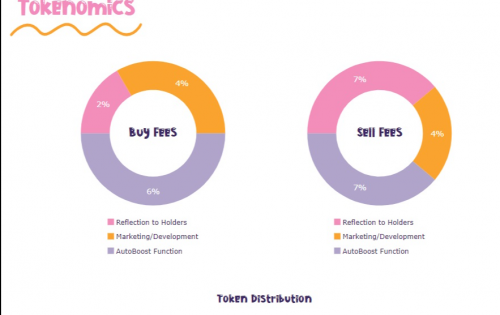

---
title: "MiniDOGE"
description: "世界上第一个自动升压、超通缩代币就在这里！Mini Doge 的任务是帮助迷路和害怕的动物找到前往最近的动物收容所的路。每次购买都会为会员提供更多的自动提振和超通缩系统。"
date: 2022-08-18T00:00:00+08:00
lastmod: 2022-08-18T00:00:00+08:00
draft: false
authors: ["seven"]
featuredImage: "minidoge.png"
tags: ["High risk","MiniDOGE"]
categories: ["nfts"]
nfts: ["High risk"]
blockchain: "BSC"
website: "https://minidoge.finance/?utm_source=DappRadar&utm_medium=deeplink&utm_campaign=visit-website"
twitter: "https://twitter.com/MiniDOGEToken"
discord: ""
telegram: "https://t.me/OfficialMiniDOGE"
github: ""
youtube: "https://www.youtube.com/c/MiniDogetoken"
twitch: "https://www.twitch.tv/minidogetoken"
facebook: "https://www.facebook.com/MiniDogeToken/"
instagram: ""
reddit: "https://www.reddit.com/r/minidoge"
medium: "https://minidogetoken.medium.com/"
steam: ""
gitbook: ""
googleplay: ""
appstore: ""
status: "Live"
weight: 
lightgallery: true
toc: true
pinned: false
recommend: false
recommend1: false
---
MiniDoge 开始它的旅程是作为一个通货紧缩的 meme 令牌，它已内置到为 Web 3.0 构建的完整生态系统中。AutoBoost 的独特功能使 MiniDoge 成为 2021 年加密领域的顶级项目之一。

它从最新发布的平台 DogeEx 开始，这是 MiniDoge 的专用 DOGE 交易所，具有跨链功能。DogeEx 允许其 80,000 名持有者质押并获得奖励，例如 Treasure 和 BNB。

在 MiniPets 的世界中创造、建造和互动。目前正在开发中的区块链游戏 MiniPets 允许用户通过征服 DOGEWorld 中的任务来获得更多的加密奖励。发现隐藏的支线任务以获得额外奖励，这些奖励将使您的排名超越竞争对手。

在赚取 MiniDOGE 代币的同时养育您的宠物 借助 MiniDOGE，我们正在为 IOS 和 Android 构建一款名为 MiniPets 的独一无二的游戏。

MiniPets 是一款基于每日参与游戏的奖励的游戏。想想 Tamagotchi 遇到 Decentraland！在 MiniPets 中，用户将能够建造任意数量的宠物，每只宠物都有一个角色，从动物收容所开始并从那里建立，最终被收养和成长。

在游戏中，每只宠物都将生活在 DOGEWorld 中，所有宠物都可以通过完成日常任务、工作并按时完成日常职责来获得游戏中的 MiniDOGE 代币。

随着每只宠物在游戏中赚取更多的 MiniDOGE 代币，他们可以购买升级品，例如衣服、食物以建立属性甚至技能，以便他们获得更好的工作，从而每天赚取更多的 MiniDOGE 代币。

迷你狗和宝藏一起来带给你狗狗快递，MiniDoge 生态系统的下一章。DogeEx 为投资者提供了在流动性池农场中进行股权投资的能力，或在单一代币池中股权以获取低风险期权。

在质押时赚取宝藏代币作为被动收入，或使用交换交换代币。这仅仅是个开始！

