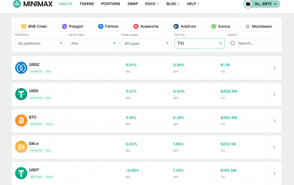
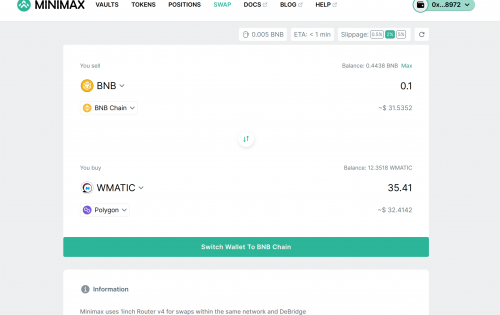
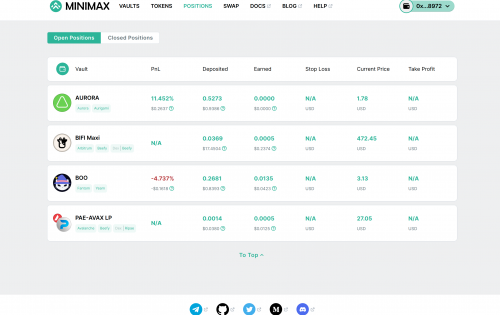

---
title: "MinimaxFinance"
description: "Minimax.finance is an aggregator of staking and yield farming opportunities with stop loss and take profit."
date: 2022-08-18T00:00:00+08:00
lastmod: 2022-08-18T00:00:00+08:00
draft: false
authors: ["seven"]
featuredImage: "minimax.png"
tags: ["DeFi","Minimax"]
categories: ["nfts"]
nfts: ["DeFi"]
blockchain: "BSC"
website: "https://app.minimax.finance/vaults?utm_campaign=visit-website&utm_medium=deeplink&utm_source=DappRadar"
twitter: "https://twitter.com/MinimaxFinance"
discord: "https://discord.com/invite/A6GJ6Qktwm"
telegram: "https://t.me/MinimaxFinanceChat"
github: "https://github.com/minimaxdefi"
youtube: ""
twitch: ""
facebook: ""
instagram: ""
reddit: ""
medium: "https://blog.minimax.finance/"
steam: ""
gitbook: ""
googleplay: ""
appstore: ""
status: "Live"
weight: 
lightgallery: true
toc: true
pinned: false
recommend: false
recommend1: false
---
他们向您展示跨主要区块链的所有主要机会，以在单个页面上投资您的代币以产生一些奖励（例如在传统金融中的银行存款）并提供一些独家功能。

这里是其中的一些：

用于抵押/登陆/耕种的投资资产价格的止损和止盈

带有 APY（年度百分比收益率）、TVL（锁定总价值）、投资资产价格等的分析图表

单一页面上不同链和协议的多种投资选择

使用Zapper.fi 中的任何代币进行Zap（即转换）存款和取款

您的代币组合以及如何投资它们的建议

在任何设备上都具有出色的应用性能

嵌入式生产就绪的跨链交换

