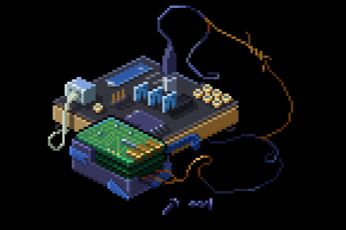

挖矿网络是 WAX 区块链上的游戏。它结合了 FreeToPlay 和 PlayToEarn 模型。每个新用户在注册游戏后立即获得免费的 NFT 玩和赚取。

Mining Networks 是一款具有革命性经济模型的游戏，从未在区块链中使用过。关键是提取的游戏资源数量不等于发行的代币数量。游戏资源的数量会随着玩家数量的增加和游戏资产的提升而增加。游戏代币的发行量将不断减少。该解决方案将确保代币价格不断上涨，并使社区免受过度通货膨胀等负面现象的影响。挖矿网络的本质是获取最大量的游戏资源，并在最佳时机兑换游戏代币。

游戏资产是 Yolo 生产的用于加密货币挖矿的设备。资产有不同的类别，它们按级别和稀有程度进行划分。

游戏对一个游戏账户可以使用的 NFT 的最大数量没有限制。每个新课程都将以微量出售。发售 24 小时后，新资产将在游戏市场上架。

