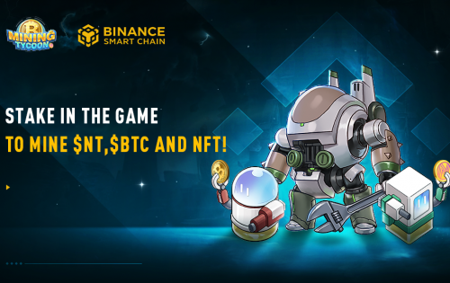
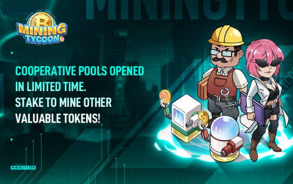

MiningTycoon是NEXTYPE推出的一款以虚拟挖矿为核心玩法的区块链游戏。

玩家将扮演矿场所有者的角色，并使用他的策略来升级和升级矿机，以获得更高的计算能力。这样就可以使用更高级的池和游戏玩法。

MiningTycoon 旨在开发具有游戏和区块链属性的令人兴奋的游戏。

MiningTycoon 以虚拟挖矿为核心游戏方式。除了 NT 奖励，挖矿还会产生其他 buff 道具，比如挖矿许可证，这是参与 BTC 矿池的必备道具。玩家每天可以收集并质押挖矿许可证以获得BTC。 

