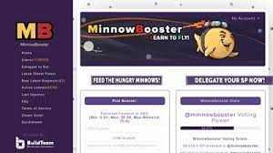

当您获得 STEEM 时，您可以将其提升至 STEEM POWER 以增加您的投票价值。将 STEEM POWER 恢复到 STEEM 需要 13 周，但您可以安全地借出您的 STEEM POWER（完全控制权归您所有）。借出 STEEM POWER 的目的是暂时让其他用户投票更有价值，直到您决定收回 STEEM POWER

推荐的最低委托金额约为 10-20 STEEM/SP，低于此值，每日回报可能太小而无法支付，具体取决于利润份额和各种其他因素。

