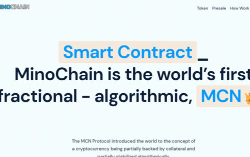
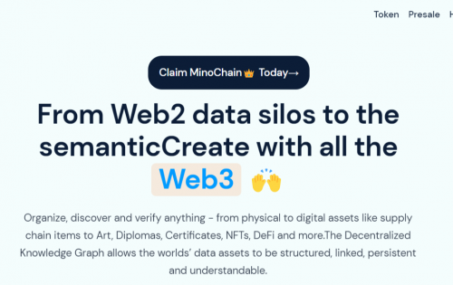
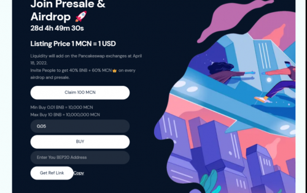

---
title: "MinoChain"
description: "MCN 协议向世界介绍了加密货币部分由抵押品支持并在算法上部分稳定的概念。"
date: 2022-08-18T00:00:00+08:00
lastmod: 2022-08-18T00:00:00+08:00
draft: false
authors: ["seven"]
featuredImage: "minochain.png"
tags: ["High risk","MinoChain"]
categories: ["nfts"]
nfts: ["High risk"]
blockchain: "BSC"
website: "https://www.minochain.com/?utm_source=DappRadar&utm_medium=deeplink&utm_campaign=visit-website"
twitter: "https://twitter.com/MinoChainoffice"
discord: "https://discord.com/invite/B2V3DVBy"
telegram: "https://t.me/MinoChainGroup"
github: "https://github.com/MinoChain"
youtube: "https://www.youtube.com/channel/UCCcjFOM-6beTCErKoP89R3Q"
twitch: ""
facebook: "https://www.facebook.com/login/?next=https%3A%2F%2Fwww.facebook.com%2Fprofile.php%3Fid%3D100079219091148"
instagram: ""
reddit: "https://www.reddit.com/user/MinoChain"
medium: "https://medium.com/@minochainofficial"
steam: ""
gitbook: ""
googleplay: ""
appstore: ""
status: "Live"
weight: 
lightgallery: true
toc: true
pinned: false
recommend: false
recommend1: false
---
MCN 协议向世界介绍了加密货币部分由抵押品支持并在算法上部分稳定的概念。

组织、发现和验证任何东西——从实物资产到数字资产，如供应链项目、艺术品、文凭、证书、NFT、DeFi 等。分散式知识图允许世界的数据资产被结构化、链接、持久和可理解。

从 Web2 数据孤岛到语义化创建Web3组织、发现和验证任何东西——从实物资产到数字资产，如供应链项目、艺术品、文凭、证书、NFT、DeFi 等。分散式知识图允许世界的数据资产被结构化、链接、持久和可理解。

与去中心化一起构建世界
借助标准化本体和可验证的完整性，查询和集成来自任何来源的资产数据。发现和分析来自通过知识图索引的多个区块链和数据源的信息。

