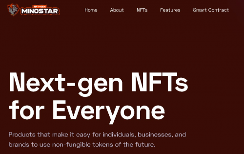
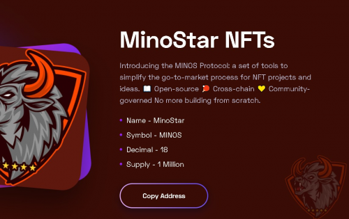
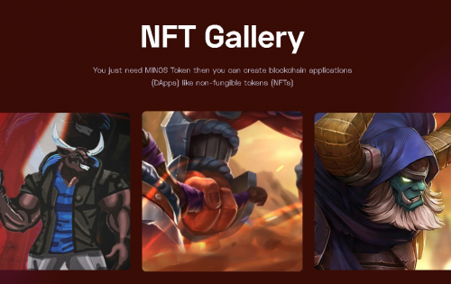

MinoStar 为去中心化金融建立新的市场机制。我们的三个可互操作的产品线让您可以在 Smart Chain 上安全地创建、交易和持有数字资产。

MinoStar 开发者门户提供介绍、技术文档和教程，MinoStar 生态系统基金为团队提供指导、营销和高达 100,000 美元的资金，以在 MinoStar 上进行构建。

设置您的钱包，然后您可以在 MinoStar 创建、出售和收集 NFT。

上传您的 NFT 并设置价格

为您出售的所有 NFT 赚取 BNB 和 MinoStar

