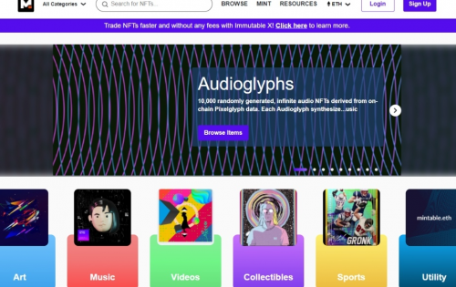
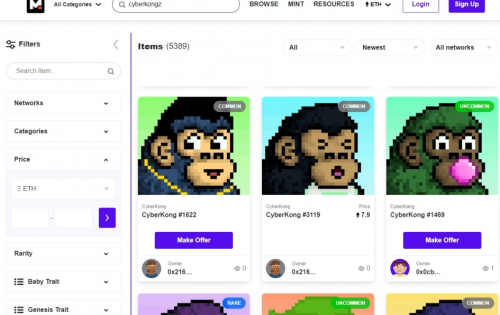
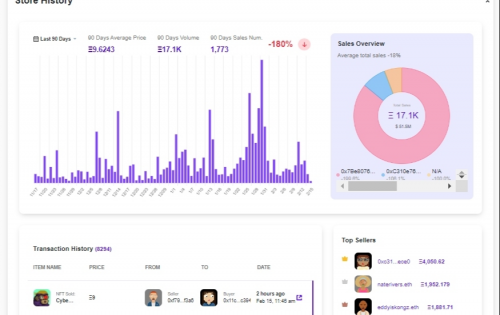

---
title: "Mintable"
description: "Mintable 是一个以实用程序为中心的市场，每个功能都致力于改善 NFT 交易体验。成立于2018年。"
date: 2022-08-18T00:00:00+08:00
lastmod: 2022-08-18T00:00:00+08:00
draft: false
authors: ["seven"]
featuredImage: "mintable.png"
tags: ["Marketplaces","Mintable"]
categories: ["nfts"]
nfts: ["Marketplaces"]
blockchain: "ETH"
website: "https://mintable.app/?utm_source=DappRadar&utm_medium=deeplink&utm_campaign=visit-website"
twitter: "https://twitter.com/mintable_app"
discord: "https://discord.com/invite/FB2br9Q"
telegram: ""
github: ""
youtube: ""
twitch: ""
facebook: ""
instagram: ""
reddit: "https://www.reddit.com/user/mintableofficial"
medium: ""
steam: ""
gitbook: ""
googleplay: ""
appstore: ""
status: "Live"
weight: 
lightgallery: true
toc: true
pinned: false
recommend: false
recommend1: false
---
Mintable 是一个以实用程序为中心的市场，具有丰富的功能和工具，可帮助 NFT 交易者充分利用其数字资产的潜力。Mintable 自动聚合以太坊和 Immutable X 上的所有 NFT，通过实时列出新铸造的 NFT，使网络上的每个 NFT 都可供用户访问。

独特的市场功能： 

1. 专有的无气体铸造 - 直接到 ETH 主网
2. 信用卡购买 NFT
3. 买家和卖家之间的直接消息传递
4. NFT艺术品的真实性检查
5. 深入的用户洞察和分析
6. 除 Marketplace 外，Mintable 生态系统还包括面向企业的 NFT 解决方案提供商 Mintology 和致力于推动 NFT 生态系统创新的投资基金 Mintable Venture Arm。

