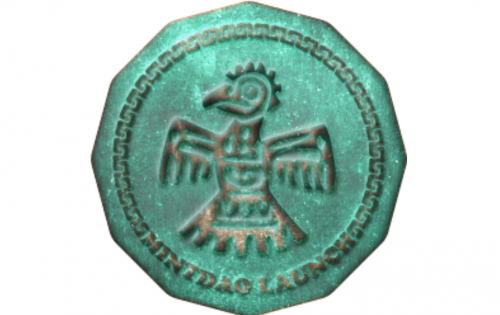
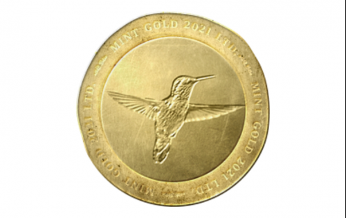

---
title: "MintDAO"
description: "Mint 项目是一个数字铸币厂，为特殊场合提供有限的硬币收藏 (NFT)。每个系列都有独特的奖励策略。"
date: 2022-08-18T00:00:00+08:00
lastmod: 2022-08-18T00:00:00+08:00
draft: false
authors: ["seven"]
featuredImage: "mintdao.png"
tags: ["Collectibles","MintDAO"]
categories: ["nfts"]
nfts: ["Collectibles"]
blockchain: "Polygon"
website: "https://mintdao.io/?utm_source=DappRadar&utm_medium=deeplink&utm_campaign=visit-website"
twitter: "https://twitter.com/MintDAO3"
discord: "https://discord.com/invite/pdVckwcAsg"
telegram: "https://t.me/mintdaoio"
github: ""
youtube: ""
twitch: ""
facebook: ""
instagram: ""
reddit: ""
medium: "https://medium.com/@mintdao"
steam: ""
gitbook: ""
googleplay: ""
appstore: ""
status: "Live"
weight: 
lightgallery: true
toc: true
pinned: false
recommend: false
recommend1: false
---
Mint的主要职责是： 铸造 NFT（硬币）集合， 铸造 MintToken， 向 NFT（硬币）代币持有者分发 MintToken， 提供交易 NFT（硬币）的市场。MintTokens将用于对有关如何使用代币的提案和为 Mint 收集新硬币的提案进行投票。铸币厂将至少铸造两种类型的硬币： 纪念币 - 为比特币减半等特殊活动铸造，合作硬币 - 与其他协议合作铸造，以促进铸币厂和第三方协议。由于我们的协议中奖励策略可能非常多样化，因此想象力是此类硬币的唯一限制。

MintDAO 旨在为第三方项目建立一个数字 NFT 铸造平台，以创建具有实用程序的 NFT 集合来奖励 NFT 持有者。每个 NFT 集合都会有一个为他们量身定制的独特方式生成的奖励系统，这将使每个项目和社区受益。

