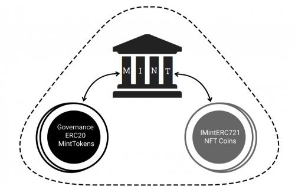

Mint的主要职责是： 铸造 NFT（硬币）集合， 铸造 MintToken， 向 NFT（硬币）代币持有者分发 MintToken， 提供交易 NFT（硬币）的市场。MintTokens将用于对有关如何使用代币的提案和为 Mint 收集新硬币的提案进行投票。铸币厂将至少铸造两种类型的硬币： 纪念币 - 为比特币减半等特殊活动铸造，合作硬币 - 与其他协议合作铸造，以促进铸币厂和第三方协议。由于我们的协议中奖励策略可能非常多样化，因此想象力是此类硬币的唯一限制。

MintDAO 旨在为第三方项目建立一个数字 NFT 铸造平台，以创建具有实用程序的 NFT 集合来奖励 NFT 持有者。每个 NFT 集合都会有一个为他们量身定制的独特方式生成的奖励系统，这将使每个项目和社区受益。

