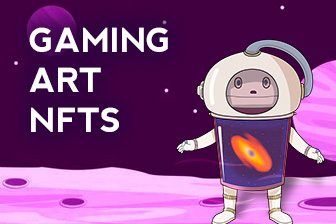

---
title: "Mintea"
description: "游戏 | 艺术 | 德菲| 收藏家和创作者的 NFTS"
date: 2022-08-18T00:00:00+08:00
lastmod: 2022-08-18T00:00:00+08:00
draft: false
authors: ["seven"]
featuredImage: "mintea.png"
tags: ["Marketplaces","Mintea"]
categories: ["nfts"]
nfts: ["Marketplaces"]
blockchain: "BSC"
website: "mintea.app"
twitter: "https://twitter.com/MinteaOfficial"
discord: ""
telegram: ""
github: ""
youtube: ""
twitch: ""
facebook: ""
instagram: ""
reddit: ""
medium: ""
steam: ""
gitbook: ""
googleplay: ""
appstore: ""
status: "Live"
weight: 
lightgallery: true
toc: true
pinned: false
recommend: false
recommend1: false
---
收藏家和创作者的终极跨链 NFT 平台。

游戏、艺术、Defi。

Mintea 是第一个功能齐全的跨链 NFT 平台，允许创作者在几分钟内铸造 NFT、拍卖或提高流动性，以便它们可以通过游戏内市场或在 PancakeSwap 和 Uniswap 等 AMM 上进行交易。

Mintea 正在为数字创作者和收藏家提供下一代工具和服务，以将数字艺术和 NFT 介绍给主流收藏家受众。

创建、交易、发布。

Mintea Marketplace 以独家艺术家作品为特色，为收藏家提供了发现和投资新兴和成熟创意人才作品的机会。

Mintea 最初在 Binance Smart Chain 上推出；

目标是成为 BSC 上可用的精选“OpenSea”。

