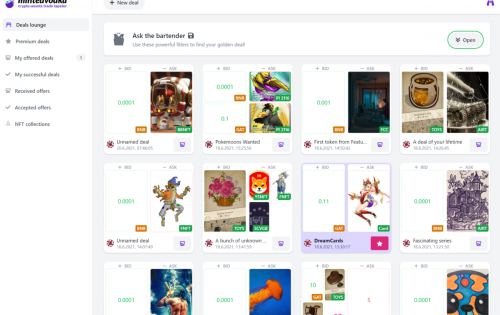
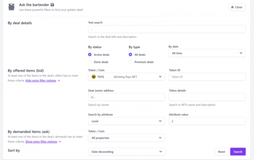
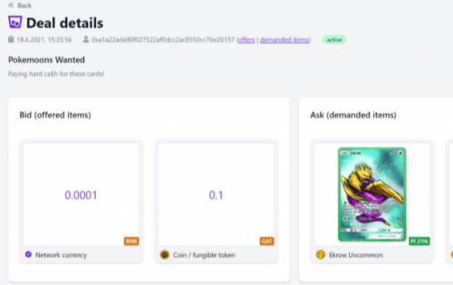

---
title: "Minted Vodka"
description: "No curation: a place where anybody can trade any NFTs and coins available on the network. Flexible: use any combination of any asset on any side: bid or ask."
date: 2022-08-18T00:00:00+08:00
lastmod: 2022-08-18T00:00:00+08:00
draft: false
authors: ["seven"]
featuredImage: "minted-vodka.png"
tags: ["Marketplaces","Minted Vodka"]
categories: ["nfts"]
nfts: ["Marketplaces"]
blockchain: "BSC"
website: "https://minted.vodka/?utm_source=DappRadar&utm_medium=deeplink&utm_campaign=visit-website"
twitter: "https://twitter.com/MintedVodka"
discord: "https://discord.com/invite/PdEj26VMjE"
telegram: "https://t.me/alchemytemple"
github: "https://github.com/AlchemyToys"
youtube: "https://www.youtube.com/channel/UCF3gCDkv7ZAvjwV7NQBV0Lg"
twitch: ""
facebook: ""
instagram: ""
reddit: "https://www.reddit.com/r/AlchemyToys/"
medium: ""
steam: ""
gitbook: ""
googleplay: ""
appstore: ""
status: "Live"
weight: 
lightgallery: true
toc: true
pinned: false
recommend: false
recommend1: false
---
灵活的交易引擎以任何组合交易任何东西！交易契约确定性交易，同时完全控制您的资产强大的搜索引擎按所有属性搜索并使用自定义包的交易详细信息固定费用交易 

用户将能够创建具有任意数量的报价和需求的交易。报价（或需求）是 网络上存在的任何 NFT、硬币或货币（BNB），用户拥有并拥有完全的转让权。

与其他市场不同，当您在 MV 上提供商品时，它会被转移并 锁定在“契约”合同中。作为回报，你会得到一份 NFT “契约”，它代表了该资产的所有权。

多链、多渠道的 NFT 啤酒、分销和管理。异国情调的 NFT 铸造、交易、用户绑定和奖励。

MintedVodka 是 GAT Network 的核心——一个连接 NFT 交易和游戏项目的网络。由德国完全透明的团队/公司于 2021 年初在 BSC 上推出。2021 年底，他们通过孵化计划和投资成为 Binance Labs 投资组合的一部分。

